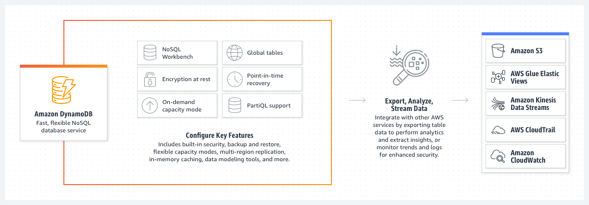

# AWS: API, Dynamo and Lambda

## [AWS API Gateway Overview](https://www.serverless.com/amazon-api-gateway)

### The main use case for Amazon API Gateway is in building serverless HTTP APIs. 

**Amazon API Gateway** is a **managed** service that allows developers to **define** the HTTP **endpoints** of a REST API or a WebSocket **API**. The service connects those endpoints with the corresponding backend logic.

API Gateway lives **between** the **backend services** of an API and its **users**.

It also **integrates** with many **other** AWS **services** like Lambda, SNS, IAM, and Cognito Identity Pools.

> "API Gateway is the piece that ties together Serverless functions and API definitions." - [Source](https://www.serverless.com/amazon-api-gateway)

### Integrating API Gateway with:
- Lambda: run Lambda functions to generate HTTP API responses.
- SNS: publish SNS notifications when an HTTP API endpoint is accessed.
- Amazon Cognito: provide authentication and authorization for your HTTP APIs.

### Caveats when using API Gateway:
- Added latency in your APIs.
- Running your own servers might well be worth it if you’re heading into latency-sensitive territory.
- You can only have 600 regional APIs per AWS account.
- The shortest possible timeout for an integration in API Gateway is 50 ms, and the longest is 29 seconds.
- the maximum payload size that can be returned by an API endpoint is 10MB.

## [AWS API Gateway](https://aws.amazon.com/api-gateway/)

> "APIs act as the "front door" for applications to access data, business logic, or functionality from your backend services." [Source](https://aws.amazon.com/api-gateway/)

AWS API Gateway **handles** **RESTful and WEBSOCKET APIs**. It allows a developer to run **multiple versions** of the same API **simultaneously**. It also provides end users with the lowest possible latency for API requests and responses.  

## [AWS DynamoDB Guide](https://www.dynamodbguide.com/what-is-dynamo-db/)

AWS offers **DynamoDB**, a hosted **NoSQL database**.

**DynamoDB** is a good fit for:

**Applications with large amounts of data and strict latency requirements.**

**Serverless applications using AWS Lambda.**

**Data sets with simple, known access patterns.**

## [AWS DynamoDB](https://aws.amazon.com/dynamodb/)

### A visional representation of how DynamoDB works:

## [Dynamoose](https://dynamoosejs.com/getting_started/Introduction)

**Dynamoose** is a **modeling tool** for DynamoDB. It is heavily *"inspired"* by **Mongoose**, which means if you are coming from **Planet MERN** the syntax will be very familar.

**Dynamoose** offers:

-Easy to use syntax
- Ability to transform data before saving or retrieving documents
- Callback & Promise support
- and more!

