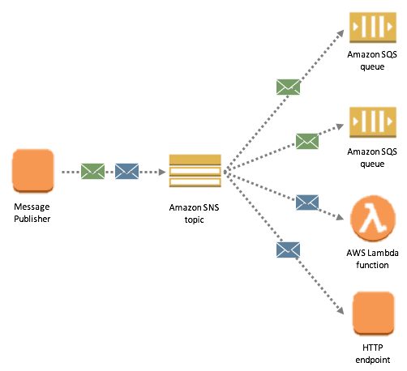

# Class 19 Reading: AWS Events

## [SQS and SNS Basics](https://www.youtube.com/watch?v=UesxWuZMZqI)

Simple Notification Service (SNS) and Simple Queue Service (SQS)

- SNS is a distributed publish-subscribe service.

- You can use SNS to send SMS messages to mobile device users in the US or to email recipients worldwide.

- SQS is distributed queuing service.

- Messages are not pushed to receivers. - Receivers have to poll SQS to receive messages. 

- Any one receiver can receive a message, process and delete it. 
-Other receivers do not receive the same message later. 

## [AWS SQS vs SNS](https://medium.com/awesome-cloud/aws-difference-between-sqs-and-sns-61a397bf76c5)

### Use SNS if: 

- You would like to be able to publish and consume batches of messages.
- You would like to allow same message to be processed in multiple ways.
- Multiple subscribers are needed.

### USe SQS if:

- You need a simple queue with no particular additional requirements.
- Decoupling two applications and allowing parallel asynchronous processing.
- Only one subscriber is needed.

