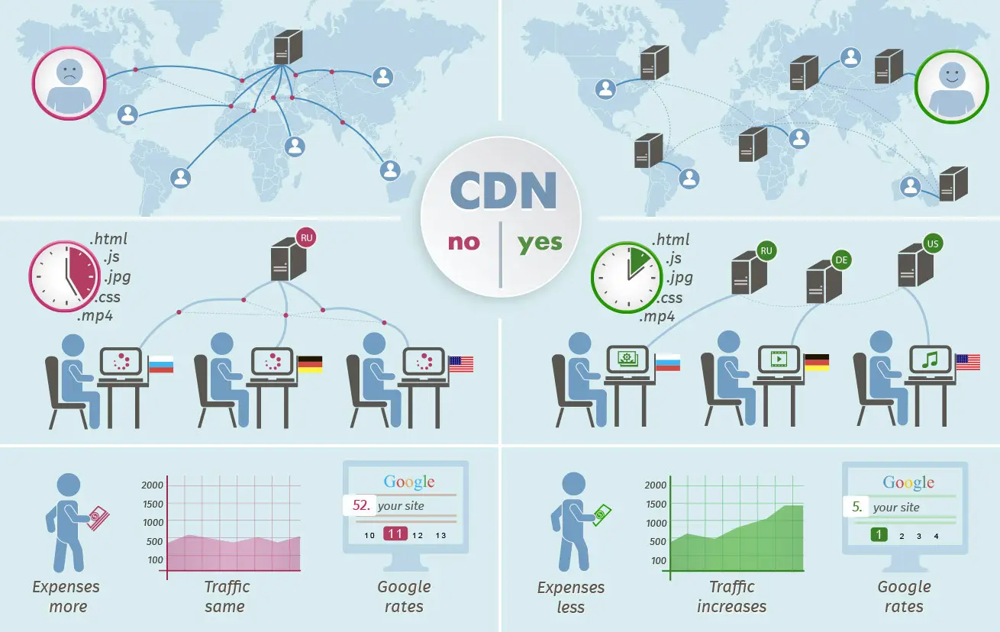

# AWS S3 and Lambda

## [AWS S3](https://aws.amazon.com/s3/)

Amazon S3 - **Amazon Simple Storage Service** is a object storage service .

S3 has object storage built to retrieve any amount of data from anywhere.

## [AWS Lambda Basics](https://www.serverless.com/aws-lambda)

AWS Lambda is a **serverless** computing service provided by Amazon Web Services (AWS). - [source](https://www.serverless.com/aws-lambda)

AWS allows a **user** to create functions and  self-contained applications and upload them to AWS Lambda. Lamda then executes those functions in an clean and scalable way.

**Lambda functions** can serve up web pages, process streams of data and even call APIs. As a user you can even integrate Lamda functionality with other AWS services.

**Serverless Computing** - you ndo not need to maintain your own server(s). The infrastructure is prepackaged and customizable.

Lambda **packages** a function into a new container and then executes that container on a **multi-tenant cluster** of machines managed by AWS. 

As a **customer** of Lamda and other AWSes, you will get **charged** based on the **allocated memory** and the amount of **run time** the function took to complete.

**Common Use Cases for AWS Lamdas**:
- Individual tasks run for a short time;
- Each task is generally self-contained;
- If there is a large difference between the lowest and highest levels in the workload of the application.
- When building APIs using AWS Lambda, one execution of a Lambda function can serve a single HTTP request.

Using **AWS Lamda** is one of the easiest way to utilize serverless architecture.

## [AWS Lambda Functions](https://aws.amazon.com/lambda/)

**AWS Lambda** is a serverless, event-driven compute service. A user can trigger Lambda from over 200 AWS services and software as a service (SaaS) applications, and only pay for what they use.

## [Content Delivery Network (CDN)](https://cyberhoot.com/cybrary/content-delivery-network-cdn/)

A **CDN** is  a **geographically distributed** group of **servers** and allows for the **fast transfer** of data.  They work **together** to provide **fast delivery** of Internet content.

They are are something that larger companies are more likely to implement.

