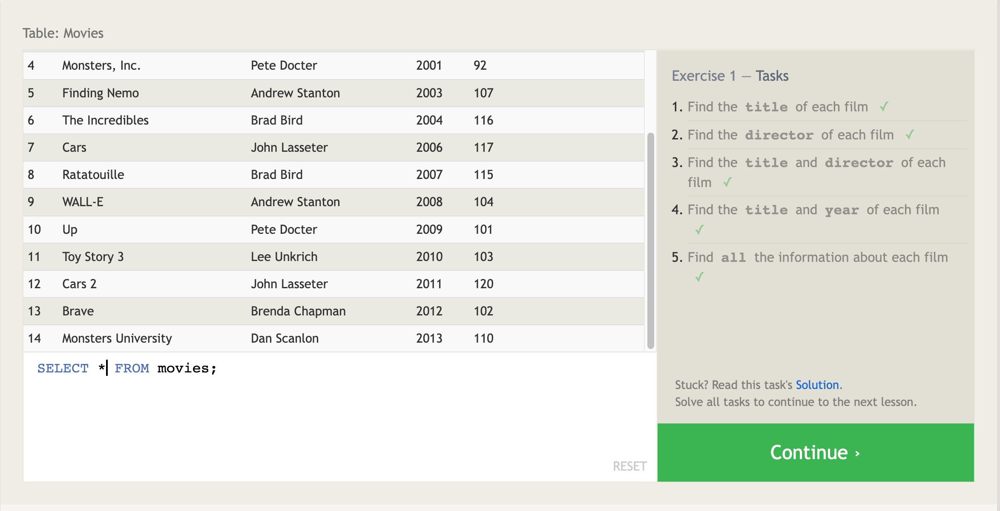

# Introduction to SQL

SQL, or Structured Query Language, is a language designed for both technies and non-technical users to SELECT or query, manipulate, and transform data from database. SQL databases provide safe and scalable storage.

### Retrieving data
	

When you want to get data from a SQL database, you need to write SELECT statements or "queries". A query is just a statement declaring what data you want, where it is in the database, and even transform the data before it is returned. 