# Introduction to SQL

SQL, or Structured Query Language, is a language designed for both technies and non-technical users to SELECT or query, manipulate, and transform data from database. SQL databases provide safe and scalable storage.

## Retrieving data
  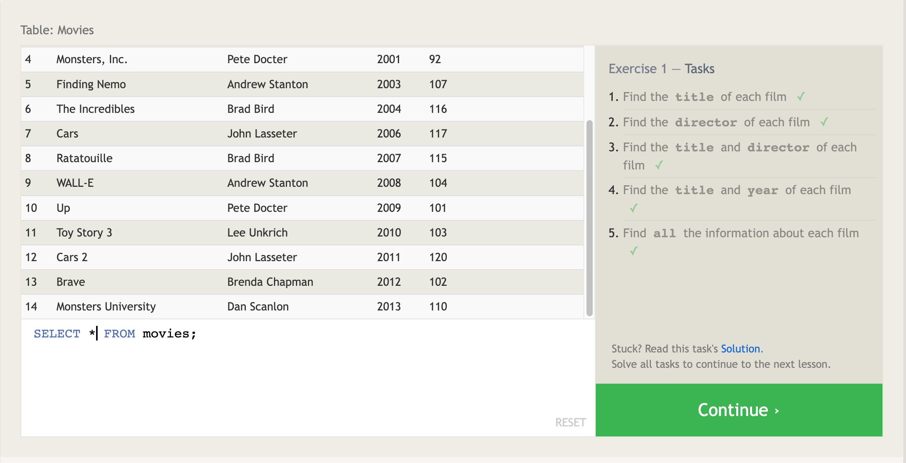

When you want to get data from a SQL database, you need to write SELECT statements or "queries". A query is just a statement declaring what data you want, where it is in the database, and even transform the data before it is returned. 

## Queries with constraints (Pt. 1)
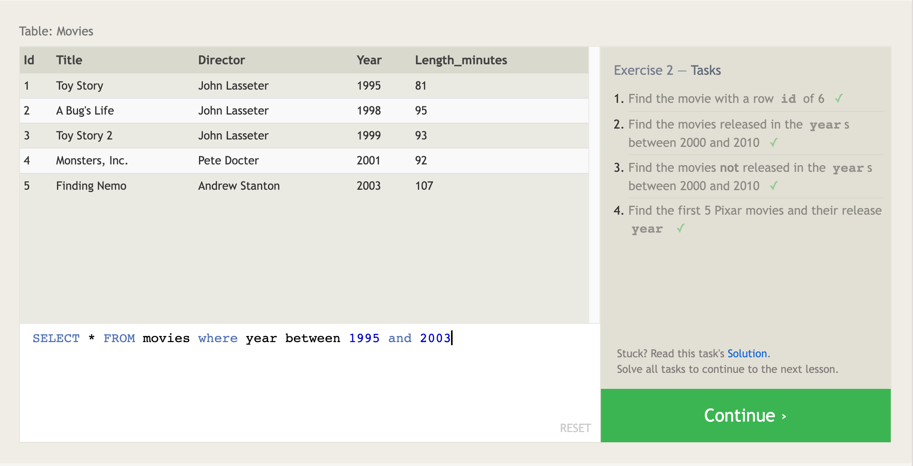

A **WHERE** clause is applied to each row of data by checking specific column values to determine whether it should be included in the results or not. Complex clauses can be constructed by joining **logical keywords**. **Example**  Return people ages **between** 18 **and** 25 **not between** 19 **and** 21. 

## Queries with constraints (Pt. 2)
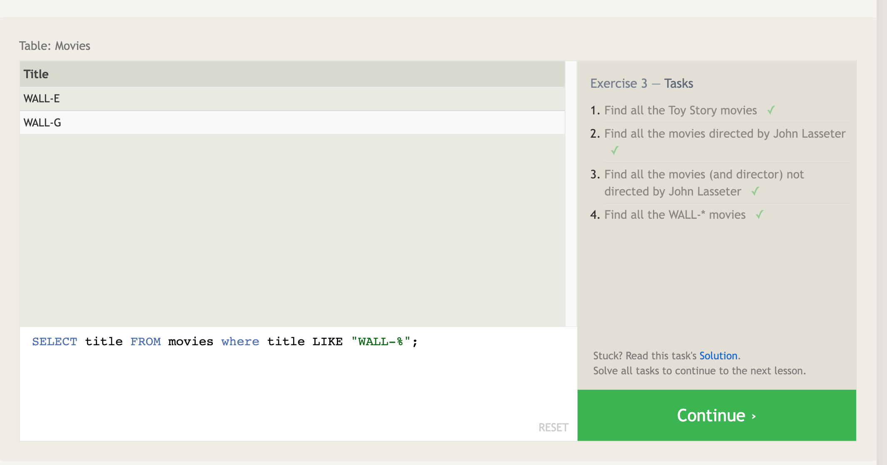

SQL supports a number of useful operators to do things like case-insensitive string comparison and wildcard pattern matching.

#### KEEP IN MIND All strings must be inside quotes ("string") so that the query parser can distinguish words in the string from SQL keywords.

## Filtering and sorting Query results
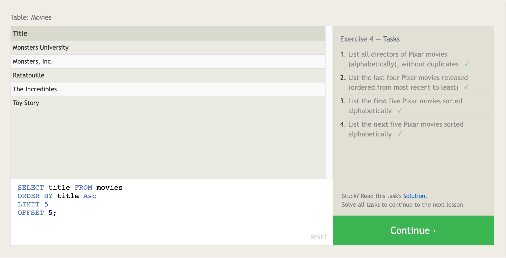

Most data in real databases are added in no particular column order, so it can be difficult to read through and understand your results.

SQL provides a way to sort your results by a given column in ascending or descending order using the **ORDER** BY clause.

The **LIMIT and OFFSET** clauses, are a useful tool to narrow down the subset of the results you care about.
**LIMIT** will reduce the number of rows to return while the optional **OFFSET** will specify where to begin counting the number rows from.

## Simple SELECT Queries Review
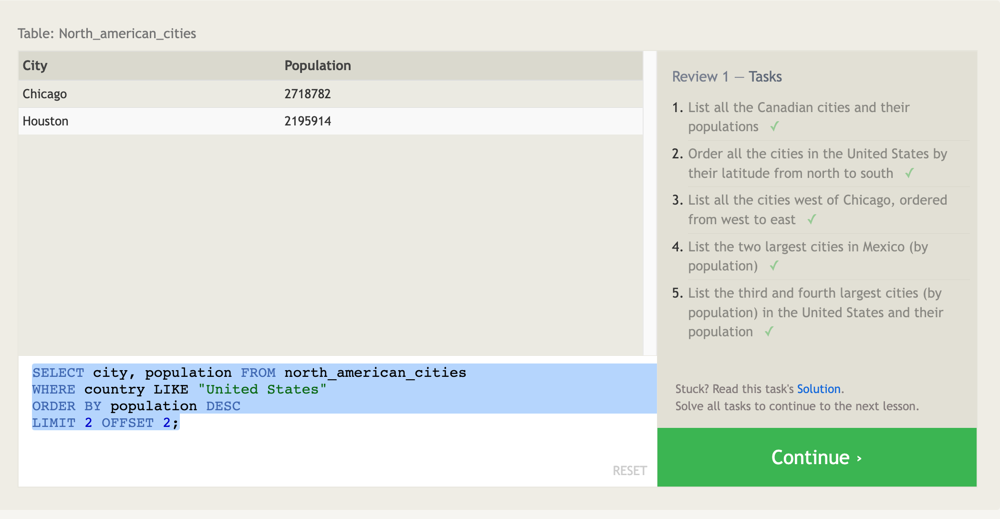

## Multi-table queries with JOINs
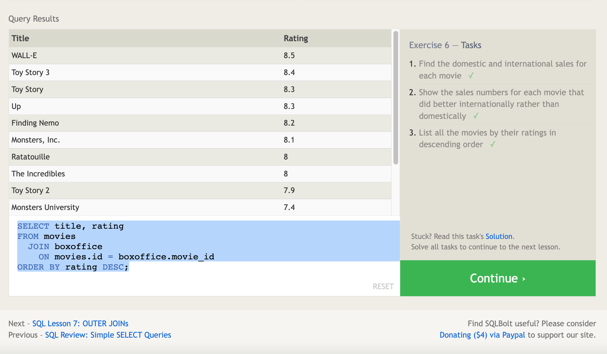

### Database normalization

Database normalization minimizes duplicate data in any single table. It allows data in the database to grow independently of each other. It can get more complex at this level and things can tend to break easily.

### Multi-table queries with JOINs

A **primary key** identifies an entity uniquely across the database when tables share information about a single entity.

A user can combine row data across two separate tables using the JOIN clause in a query. 

Directly from the reading "The **INNER JOIN** is a process that matches rows from the first table and the second table which have the same key (as defined by the ON constraint) to create a result row with the combined columns from both tables. After the tables are joined, the other clauses we learned previously are then applied."

## Inserting rows
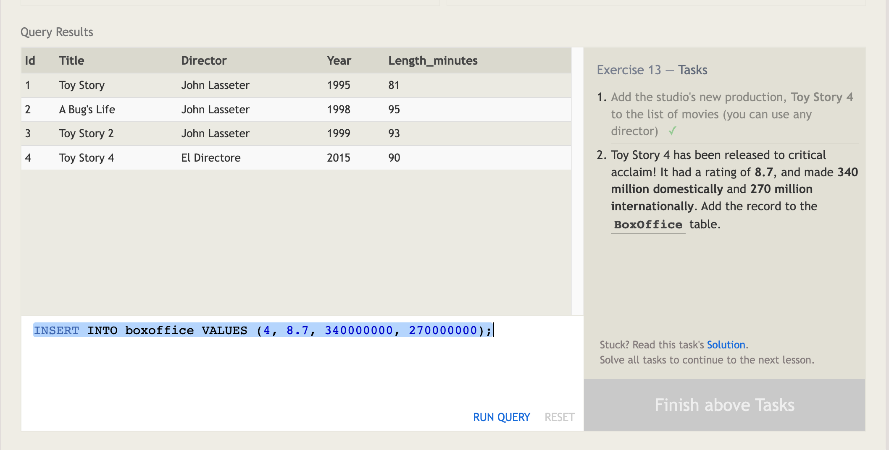

**Database SChema** - dictates the structure each table has. It also controls the datatypes each column of the table can contain. Being a **fixed structure** allows the database to be efficient and consistent while storing an endless amount of rows.
To insert a new row use an INSERT statement. In this statement you can delcare which table to write into, the columns of data that you are filling, and one or more rows of data to insert. 
As a rule, each row of data you insert should contain values for every corresponding column in the table. It is even possible to insert multiple rows at a time by just listing them sequentially. 

## Updating rows
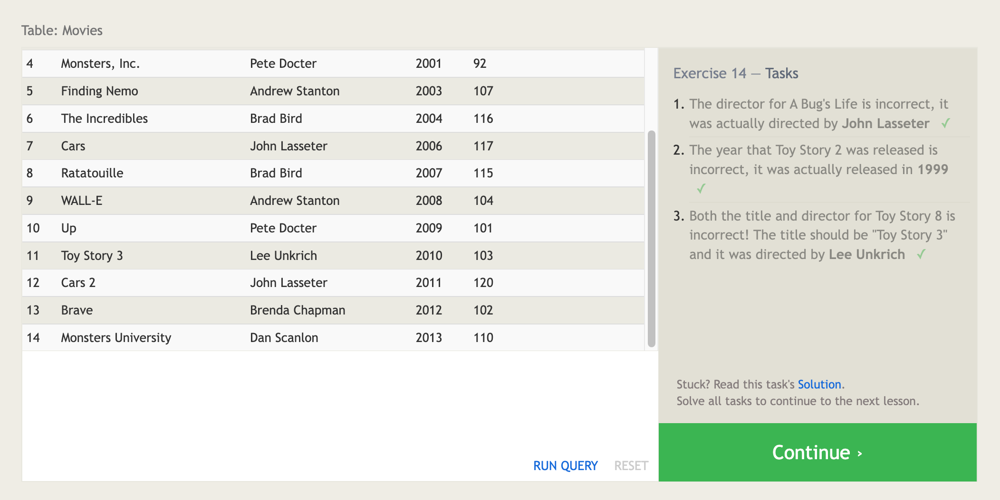

You can **UPDATE** rows, but you have to specify exactly which table, columns, and rows to update and just importantly the data you are updating has to match the data type of the columns in the table schema.

## Deleting rows
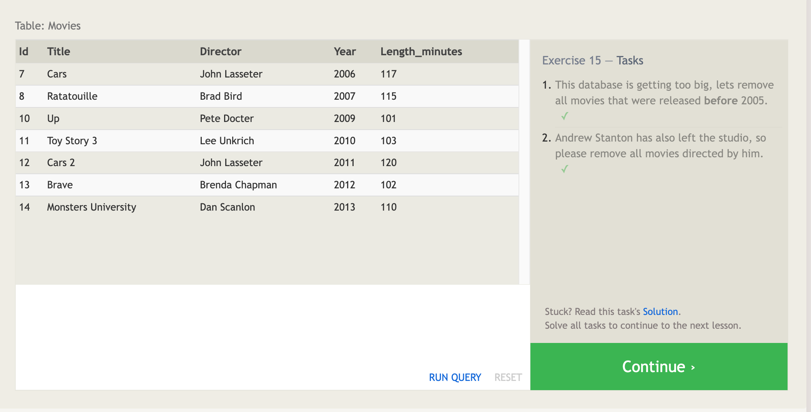

Use a **DELETE** statement and describe the table to act on, and the rows of the table to delete through the WHERE clause. 

## Creating tables
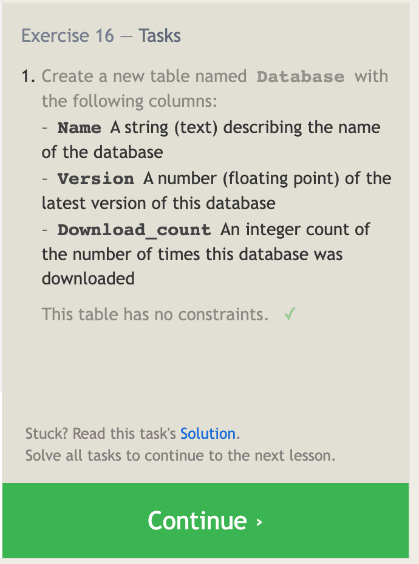

Use **Create Table** whenever you have new entities and relationships to store in your database. To define to structure of the new table, you first define the table's schema. 

**Table data types** 
The common types of databases support numeric, string, and other miscellaneous things like dates, booleans, or even binary data. 

**Table constraints**
Each column can have additional table constraints on it which limit what values can be inserted into that column. 

## Altering tables
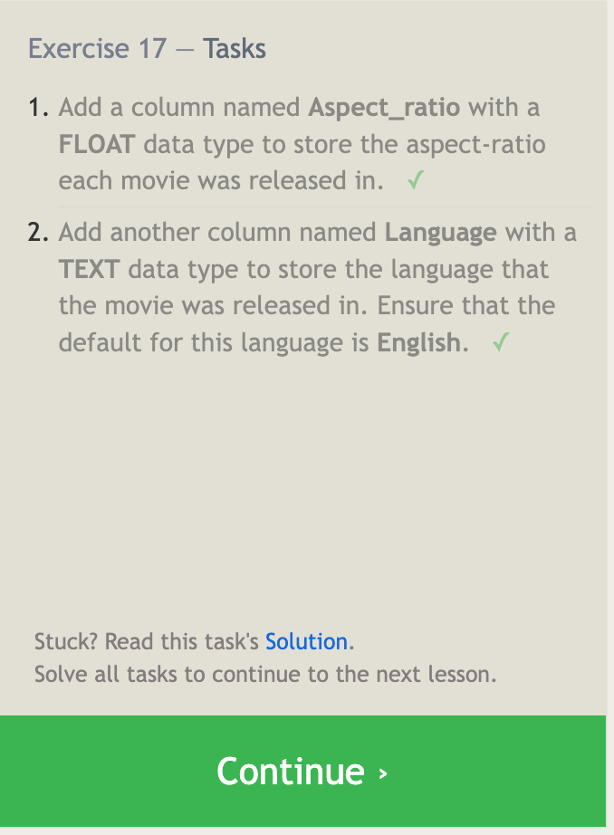

As a user of SQL you can use the **ALTER TABLE** statement to add, remove, or modify columns and table constraints. Specify the data type of the column along with any potential table constraints and default values to be applied to both existing and new rows.

**Removing columns** - If the below example doesn;t work, then you must create a new table and migrate the data over. 

---
ALTER TABLE mytable

DROP column_to_be_deleted;

---

**Renaming the table** - To rename the actual table create the following statement, but be sure to substitute your specifi info.

--- 

ALTER TABLE mytable

RENAME TO new_table_name;

---

## Dropping tables
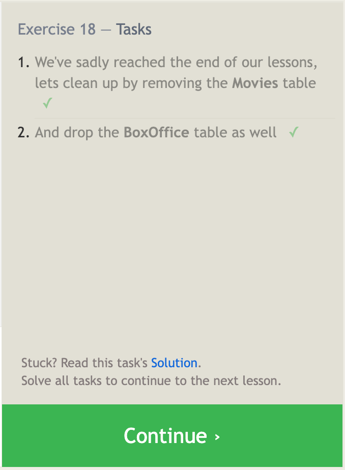

In the rare event you want to remove an entire table including its schema and metadata, you can use th **Drop Table** statement. 

